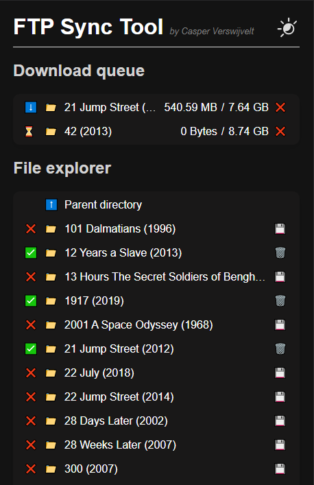
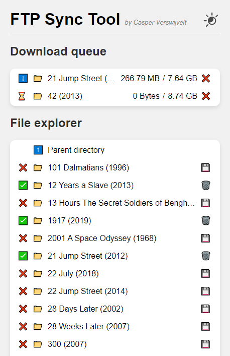

# FTP Sync Tool

This tool allows you to selectively download files from a remote FTP server to your own server, with a clean and simple web interface. Perfect if you want to leech from your friend who has a huge media library!

## Screenshots

| Dark mode | Light mode |
|---|---|
|   |   |

## How to use

Detailed instructions coming soon!
If you want to take a look already you can do so by copying `sample_config.json` to `config.json`, customizing it to your liking and running `npm install && npm run build && npm start`.